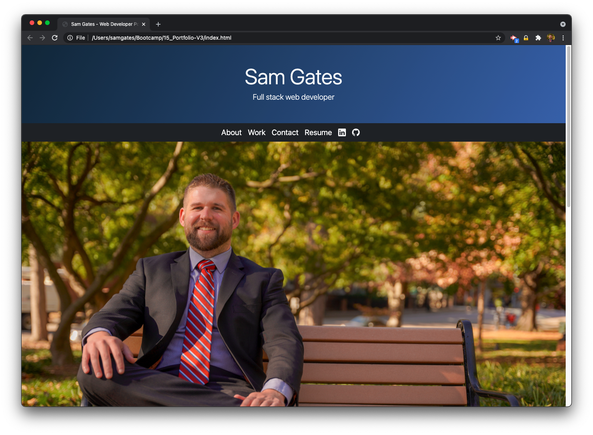
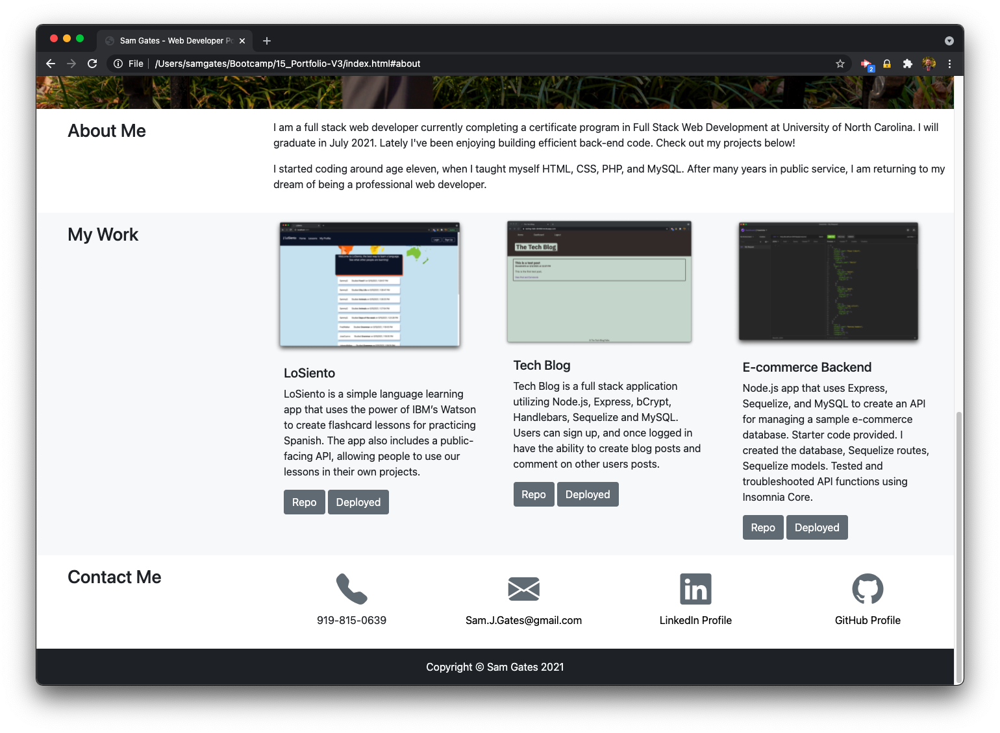

## 08 - Updated Portfolio Page

## Description

For this homework assignment, I completely revised my portfolio page. I utilized customized Bootstrap elements, including a jumbotron, navbar, and cards to display content. I designed my portfolio page using the Bootstrap grid layout. I utilized jQuery to selectively modify content on the page. The design is responsive to different screen sizes as well. I chose three projects to display on the website: Stock News, Weather App! and Workday Scheduler. Stock News was a group collaboration. Weather App! and Workday Scheduler are both homework assignments that I felt reflected my current abilities as a web developer. 

## Actions taken

1. Reviewed guidelines set out in homework README
2. Designed simple layout using a header, navbar, content section and footer
3. Utilized Bootstrap so that the page would have consistent styling and be responsive to different screen sizes
4. Utilized jQuery to dynamically display content 
5. Used Google Docs to generate a PDF resume
6. Used GitHub to track changes to repository
7. Selected three projects which showcase current skill level

## Link to deployed project

See the deployed project by following this link: https://sg0703.github.io/08_Gates-Portfolio-New/
See the code repository here: https://github.com/sg0703/08_Gates-Portfolio-New

## Collaborators

Sam Gates (sam.j.gates@gmail.com)

## Screenshots

